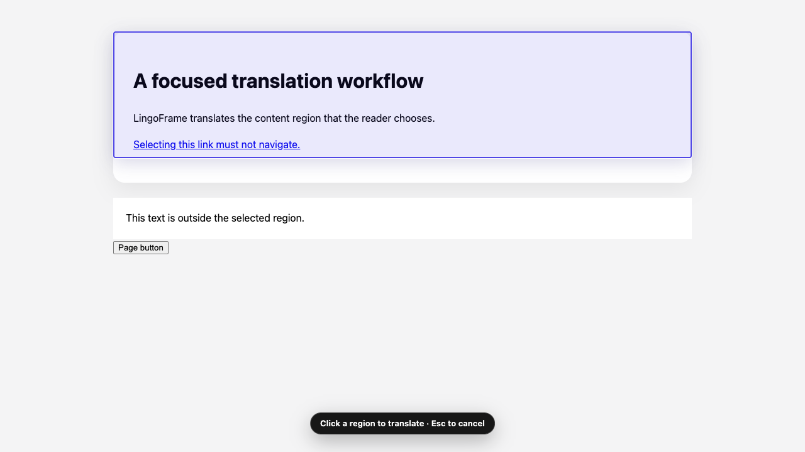

# LingoFrame



LingoFrame 是一个小而清晰的 Chrome 区域翻译扩展：像 DevTools 元素选择器一样指向页面中的内容区域，点击后只翻译该 DOM 容器里的可读文字。

> **Select a region. Translate what matters.**

它适合文章正文、评论、帖子、聊天消息、表格单元格、文档段落、侧边栏和卡片等场景。原文会保留在页面中，译文默认用双语展示方式紧跟在对应原文下方。


## Installation

准备 Node.js 20.12 或更高版本。克隆或下载本仓库后，可以从源码构建并加载未打包扩展：

```bash
cd lingo-frame
corepack pnpm install --frozen-lockfile
pnpm build
```

然后在 Chrome 中完成安装：

1. 打开 `chrome://extensions`；
2. 开启右上角的“开发者模式”；
3. 点击“加载已解压的扩展程序”；
4. 选择项目中的 `output/chrome-mv3` 目录。

## Usage

1. 首次点击工具栏里的 LingoFrame 图标会自动打开设置页，也可以从扩展详情页进入“扩展程序选项”；
2. 选择目标语言和 `DeepSeek` 或 `OpenAI-compatible` provider，填写 API Key、Base URL 与模型名；
3. 点击 `Test connection` 验证配置，再保存；
4. 打开任意普通 HTTP/HTTPS 网页，点击工具栏里的 LingoFrame 图标，或按 `Alt+Shift+L`；
5. 移动鼠标查看候选区域边界，点击一个区域开始翻译；
6. 按 `Escape` 随时取消选择，再次点击扩展图标可以重新选择。

Chrome 内部页面、Chrome Web Store 等浏览器保护页面不允许扩展注入内容脚本。跨域 iframe 也受浏览器隔离规则约束。

远程 API 端点必须使用 HTTPS；为兼容本机模型服务，`localhost`、`127.0.0.1` 和 `[::1]` 可以使用 HTTP。

## What it includes

- DevTools 风格的 DOM Region Picker，带悬停高亮、点击拦截、滚动/缩放重定位与 `Escape` 清理；
- 限定在所选 DOM 容器内的可读文本扫描，不会向父级或页面其他区域扩张；
- 与 FluentRead 一致的页内双语展示模型，以及逐段加载和失败原因；
- DeepSeek 与 OpenAI Chat Completions-compatible API，共用一个可扩展的 provider 边界；
- 目标语言、模型、端点与 API Key 的本地扩展存储；
- Manifest V3 的 `activeTab` 按需注入，只为用户配置的 API origin 请求可选网络权限。

## Privacy

LingoFrame 只会把用户明确选中区域中的文字发送给已配置的翻译 provider。API Key 保存在当前 Chrome profile 的扩展本地存储中，并限制为扩展可信上下文可读；页面脚本无法直接读取它。

## 致谢

感谢 FluentRead 为 LingoFrame 的翻译流程和双语展示提供了重要的参考基础。
